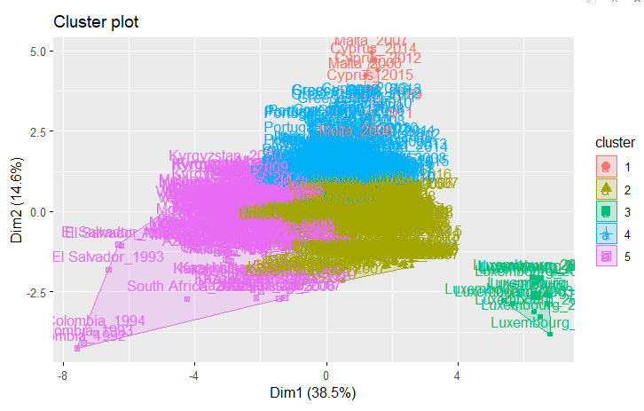
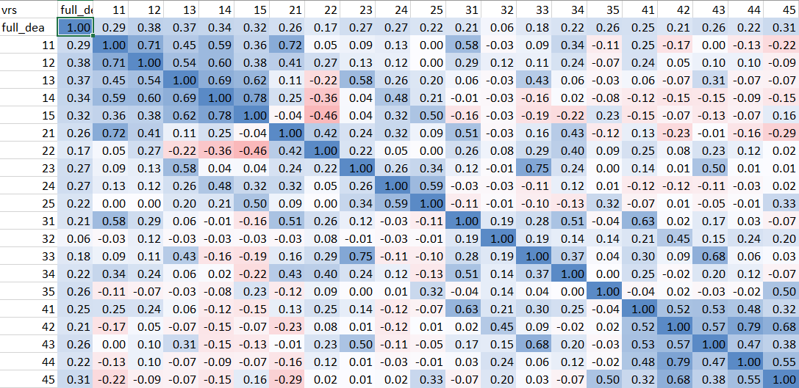

## load libraries and other stuff

```{r}
library(tidyverse)
library(ggplot2)
library(gridExtra)
library(factoextra)
library(countrycode)

source("D:/Daten/Bildung/HS Mannheim/BA/bachelors-thesis/code/functions.R")

regions <- read_csv("D:/Daten/Bildung/HS Mannheim/BA/bachelors-thesis/regions.csv", show_col_types = FALSE)

Africa <- regions$country[regions$continent == "Africa"]
Europe <- regions$country[regions$continent == "Europe"]
Americas <- regions$country[regions$continent == "Americas"]
Asia <- regions$country[regions$continent == "Asia"]
Oceania <- regions$country[regions$continent == "Oceania"]
EU <- regions$country[regions$EU == TRUE]
OECD <- regions$country[regions$OECD == TRUE]
```

## load data

```{r}

scaled <- FALSE

if (scaled == TRUE) {
  s <- "_scaled"
} else {
  s <- ""
}

# general data sets
data_general <- read_csv(paste("D:/Daten/Bildung/HS Mannheim/BA/bachelors-thesis/processed_data/Working Files 112/data_general", s, ".csv", sep = ""))

wellfare_ind <- read_csv(paste("D:/Daten/Bildung/HS Mannheim/BA/bachelors-thesis/processed_data/Working Files 112/wellfare_ind", s, ".csv", sep = ""))

wellfare_ind$cluster <- as.factor(wellfare_ind$cluster)

avg_wellfare_ind <- read_csv(paste("D:/Daten/Bildung/HS Mannheim/BA/bachelors-thesis/processed_data/Working Files 112/avg_wellfare_ind", s, ".csv", sep = ""))


# means and variance
means_country <- read_csv(paste("D:/Daten/Bildung/HS Mannheim/BA/bachelors-thesis/processed_data/Working Files 112/means_country", s, ".csv", sep = ""))

means_year <- read_csv(paste("D:/Daten/Bildung/HS Mannheim/BA/bachelors-thesis/processed_data/Working Files 112/means_year", s, ".csv", sep = ""))

variance_country <- read_csv(paste("D:/Daten/Bildung/HS Mannheim/BA/bachelors-thesis/processed_data/Working Files 112/variance_country", s, ".csv", sep = ""))

variance_year <- read_csv(paste("D:/Daten/Bildung/HS Mannheim/BA/bachelors-thesis/processed_data/Working Files 112/variance_year", s, ".csv", sep = ""))


# wide data sets
data_crs_wider_eff <- read_csv(paste("D:/Daten/Bildung/HS Mannheim/BA/bachelors-thesis/processed_data/Working Files 112/data_crs_wider_eff", s, ".csv", sep = ""))

data_crs_wider_rank <- read_csv(paste("D:/Daten/Bildung/HS Mannheim/BA/bachelors-thesis/processed_data/Working Files 112/data_crs_wider_rank", s, ".csv", sep = ""))

data_vrs_wider_eff <- read_csv(paste("D:/Daten/Bildung/HS Mannheim/BA/bachelors-thesis/processed_data/Working Files 112/data_vrs_wider_eff", s, ".csv", sep = ""))

data_vrs_wider_rank <- read_csv(paste("D:/Daten/Bildung/HS Mannheim/BA/bachelors-thesis/processed_data/Working Files 112/data_vrs_wider_rank", s, ".csv", sep = ""))
```

## Problems

at first sight

-   target non-murder rate above 100 in crs data set

-   target mean years in school sometimes ridiculously high

-   Same goes for life expectancy

## Make very long datasets

```{r}
# Both

data_verylong_input <- data_general %>%
  select(dmu, country, year, efficiency_crs, efficiency_vrs, CO2, material_footprint, foreign_investment, government_debt) %>%
  pivot_longer(cols = -c("dmu", "country", "year"), names_to = "indicator")

data_verylong_output <- data_general %>%
  select(dmu, country, year, efficiency_crs, efficiency_vrs, life_expectancy, income, mean_years_in_school, murder) %>%
  pivot_longer(cols = -c("dmu", "country", "year"), names_to = "indicator")
```

# Analyses

## VRS vs. CRS

### Same order?

```{r}
identical(data_general$rank_crs, data_general$rank_vrs)
```

> Ranks are not identical.

### Over time

#### On average

```{r}
means_year %>%
  select(year, efficiency_crs, efficiency_vrs) %>%
  pivot_longer(cols = c("efficiency_crs","efficiency_vrs"), names_to = "method") %>%
  ggplot(aes(year, value))+
  geom_line(aes(color = method))
 
```

#### Per country

```{r}
data_general %>%
  # filter(efficiencies <= quantile(data_crs$efficiencies)[2]) %>%
  filter(country %in% c("Germany", "United States", "France", "Thailand", "Ghana", "South Africa")) %>%
  ggplot(aes(year, efficiency_crs))+
  geom_point(aes(
    color=country
    )
  )+
  geom_line(aes(
    color=country
    )
  )
```

### Correlation

```{r}
cor(data_general %>% select(efficiency_crs, efficiency_vrs))
```

### 100% efficient

```{r}
sum(data_general$efficiency_crs == 1) # = 57
sum(data_general$efficiency_vrs == 1) # = 131
```

## Most efficient, Least efficient, big changes

### CRS

On average

```{r}
means_country$country[means_country$efficiency_crs == 1]

means_country$country[means_country$efficiency_crs == min(means_country$efficiency_crs)]

head(means_country[order(-means_country$efficiency_crs),],10)
```

Individual DMUs

```{r}
crs_100 <- unique(data_general$country[data_general$efficiency_crs == 1])
crs_100
```

```{r}
head(data_general[order(data_general$rank_crs),],70)
tail(data_general[order(data_general$rank_crs),],20)
```

```{r}
unique(head(data_general[order(data_general$rank_crs),],70)$country)
unique(tail(data_general[order(data_general$rank_crs),],20)$country)
```

### VRS

On average:

```{r}
means_country$country[means_country$efficiency_vrs == 1]

means_country$country[means_country$efficiency_vrs == min(means_country$efficiency_crs)]

head(means_country[order(-means_country$efficiency_vrs),],20)
```

Individual DMUs

```{r}
vrs_100 <- unique(data_general$country[data_general$efficiency_vrs == 1])
# write_csv(as.data.frame(unique(data_general$country[data_general$efficiency_vrs == 1])), "VRS_100_percent_countries.csv")
vrs_100

head(data_general[order(data_general$rank_vrs),],70)
tail(data_general[order(data_general$rank_vrs),],20)

unique(tail(data_general[order(data_general$rank_vrs),],20)$country)
```

### Difference

```{r}
crs_vrs_10_diff <- setdiff(vrs_100, crs_100)
crs_vrs_10_diff
```

> CRS efficient countries often developing countries, VRS developed...why?

```{r}
crsvrs_means_comp <- t(means_country %>%
  filter(country %in% crs_100) %>%
  select(-country, -efficiency_crs, -efficiency_vrs) %>%
  summarise_all(mean))

crsvrs_means_comp <- cbind(crsvrs_means_comp, t(means_country %>%
  filter(country %in% vrs_100) %>%
  select(-country, -efficiency_crs, -efficiency_vrs) %>%
  summarise_all(mean)))

crsvrs_means_comp <- cbind(crsvrs_means_comp, t(means_country %>%
  filter(country %in% crs_vrs_10_diff) %>%
  select(-country, -efficiency_crs, -efficiency_vrs) %>%
  summarise_all(mean)))

crsvrs_means_comp <- as.data.frame(crsvrs_means_comp)
colnames(crsvrs_means_comp) <- c("crs", "vrs", "crs_vrs_diff")

crsvrs_means_comp$diff <- (crsvrs_means_comp$vrs / crsvrs_means_comp$crs) * 100
crsvrs_means_comp$diff_2 <- (crsvrs_means_comp$crs_vrs_diff / crsvrs_means_comp$crs) * 100

crsvrs_means_comp
```

## Correlation between efficiency and input factors

CO2

```{r}
cor(data_general[c("CO2", "efficiency_crs")]) # = -28
cor(data_general[c("CO2", "efficiency_vrs")]) # = -27
```

Slight negative correlation (-0.4). The more CO2 emissions per person, the worse the

Foreign Direct Investment

```{r}
cor(data_general[c("foreign_investment", "efficiency_crs")]) # = -45
cor(data_general[c("foreign_investment", "efficiency_vrs")]) # = -36
```

No correlation between FDI and the resulting efficiencies

Material footprint

```{r}
cor(data_general[c("material_footprint", "efficiency_crs")]) # = -33
cor(data_general[c("material_footprint", "efficiency_vrs")]) # = -23
```

Small correlation (-0.3)

```{r}
cor(data_general[c("government_debt", "efficiency_crs")]) # = -43
cor(data_general[c("government_debt", "efficiency_vrs")]) # = -25
```

> Foreign investment highest input on efficiency
>
> Order:
>
> 1.  foreign investment
> 2.  government debt
> 3.  material footprint
> 4.  CO2


Varianz durch Mittelwert

```{r}
c(var(data_general$CO2),var(data_general$material_footprint)
,var(data_general$foreign_investment)
,var(data_general$government_debt))/c(mean(data_general$CO2),
                                      mean(data_general$material_footprint)
,mean(data_general$foreign_investment)
,mean(data_general$government_debt))
```

> foreign investment highest relationship between variance and mean, supports the high (negative) correlation between efficiency and foreign investment
>
> Order:
>
> 1.  foreign investment
> 2.  government debt
> 3.  material footprint
> 4.  CO2
>
> Scaled (without recalculation of FDI)
>
> 1.  government debt
> 2.  material footprint
> 3.  CO2
> 4.  foreign investment

## Performance of country-year combinations with high inputs

```{r}
CO2_upperQuantile <- subset(data_general, CO2 > as.numeric(quantile(data_general$CO2)[4]))
CO2_lowerQuantile <- subset(data_general, CO2 <= as.numeric(quantile(data_general$CO2)[2]))

mean(CO2_upperQuantile$efficiency_crs)
mean(CO2_lowerQuantile$efficiency_crs)

mean(CO2_upperQuantile$efficiency_vrs)
mean(CO2_lowerQuantile$efficiency_vrs)
```

```{r}
MF_upperQuantile <- subset(data_general, material_footprint > as.numeric(quantile(data_general$material_footprint)[4]))
MF_lowerQuantile <- subset(data_general, material_footprint <= as.numeric(quantile(data_general$material_footprint)[2]))

mean(MF_upperQuantile$efficiency_crs)
mean(MF_lowerQuantile$efficiency_crs)

mean(MF_upperQuantile$efficiency_vrs)
mean(MF_lowerQuantile$efficiency_vrs)
```

```{r}
FDI_upperQuantile <- subset(data_general, foreign_investment > as.numeric(quantile(data_general$foreign_investment)[4]))
FDI_lowerQuantile <- subset(data_general, foreign_investment <= as.numeric(quantile(data_general$foreign_investment)[2]))

mean(FDI_upperQuantile$efficiency_crs)
mean(FDI_lowerQuantile$efficiency_crs)

mean(FDI_upperQuantile$efficiency_vrs)
mean(FDI_lowerQuantile$efficiency_vrs)
```

```{r}
DEBTS_upperQuantile <- subset(data_general, government_debt > as.numeric(quantile(data_general$government_debt)[4]))
DEBTS_lowerQuantile <- subset(data_general, government_debt <= as.numeric(quantile(data_general$government_debt)[2]))

mean(DEBTS_upperQuantile$efficiency_crs)
mean(DEBTS_lowerQuantile$efficiency_crs)

mean(DEBTS_upperQuantile$efficiency_vrs)
mean(DEBTS_lowerQuantile$efficiency_vrs)
```

## Deep-dive into some countries

Very efficient, very in-efficient, big change in efficiency over time

Countries to consider (CRS):

| 100% efficiency in some years |                           | Lowest efficiency in some years |                 | Big change in efficiency |
|---------------|---------------|---------------|---------------|---------------|
| Albania                       | 1996-1998                 | Malta                           | 2006-2009, 2011 |                          |
| Armenia                       | 2006-2008                 | Cyprus                          | 10,12,12,14,15  |                          |
| Belarus                       | 1998-2001                 |                                 |                 |                          |
| Denmark                       | 1997,2004,2012            |                                 |                 |                          |
| Estonia                       | 2003-2008                 |                                 |                 |                          |
| Germany                       | 2011,2014                 |                                 |                 |                          |
| Kazakhstan                    | 2005,2006,2008            |                                 |                 |                          |
| Moldova (very often 100%)     | 1999-2016                 |                                 |                 |                          |
| Switzerland                   | 1990-1993,1997, 2011-2013 |                                 |                 |                          |
|                               |                           |                                 |                 |                          |

### Iceland

```{r}
deepdive("Iceland", "i")
deepdive("Iceland", "o")
```

### Bulgaria

```{r}
deepdive("Bulgaria", "i")
deepdive("Bulgaria", "o")
```

### Colombia

```{r}
deepdive("Colombia", "i")
deepdive("Colombia", "o")
```

### Albania

Albania is in the years 1996 to 1998 fully efficient. As we can see in the following plot this this coincides with relatively low inputs.

```{r}
deepdive("Albania", "i")
deepdive("Albania", "o")
```

Interestingly, the outputs do not all follow the same pattern. Income, life expectancy and mean years in school are the lowest in the beginning.

### Armenia

```{r}
deepdive("Armenia", "i")
deepdive("Armenia", "o")
```

### Denmark

```{r}
deepdive("Denmark", "i")
deepdive("Denmark", "o")
```

### Estonia

```{r}
deepdive("Estonia", "i")
deepdive("Estonia", "o")
```

### Germany

```{r}
deepdive("Germany", "i")
deepdive("Germany", "o")
```

### Kazakhstan

```{r}
deepdive("Kazakhstan", "i")
deepdive("Kazakhstan", "o")
```

### Moldova

```{r}
deepdive("Moldova", "i")
deepdive("Moldova", "o")
```

## Comparison with BIP/HDI/HPI

### **GDP (income/gdp per person)**

```{r}
wellfare_ind %>%
  select(income, efficiency_crs, efficiency_vrs)%>%
  cor()
```

Almost no correlation

Best performing countries based on GDP

```{r}
# Individual DMUS
unique(head(data_general[order(-data_general$income),],200)$country)

# on average
unique(head(means_country[order(-means_country$income),],10)$country)

# latest year
latest_data <- subset(data_general, year == 2016)
latest_data[order(-latest_data$income),]
nrow(latest_data)
```

### **HDI**

```{r}
wellfare_ind %>%
  select(efficiency_crs, efficiency_vrs, hdi)%>%
  cor()
```

Slight negative correlation between efficiencies and HDI.

Visualization, color-coded by previously clusters, continents

```{r}
# Color-coded by cluster
vrs_vs_hdi_cluster <- wellfare_ind %>%
  ggplot(aes(efficiency_vrs, hdi))+
  geom_point(aes(
    color = cluster
  ))+
  theme(legend.position="bottom")
vrs_vs_hdi_cluster
```

The clusters seem to very well represent the different development classes based on the HDI



```{r}
wellfare_ind %>%
  ggplot(aes(cluster, hdi))+
  geom_boxplot()+
  geom_jitter(width = 0.1,
              alpha = 0.5,
              aes(color = efficiency_crs))
```

```{r}
# Color-coded by continent
vrs_vs_hdi_continent <- wellfare_ind %>%
  ggplot(aes(efficiency_vrs, hdi))+
  geom_point(aes(
    color = continent
  ))+
  theme(legend.position="bottom")
vrs_vs_hdi_continent
```

```{r}
grid.arrange(vrs_vs_hdi_cluster, vrs_vs_hdi_continent, ncol = 1)
```

#### Average values

```{r}
avg_wellfare_ind %>% 
  ggplot(aes(efficiency_crs, hdi)) +
  geom_point(aes(color = cluster))
```

```{r}
avg_wellfare_ind %>% 
  ggplot(aes(efficiency_crs, hdi)) +
  geom_point(aes(color = continent))
```

### HPI

```{r}
wellfare_ind %>%
  select(efficiency_crs, efficiency_vrs, hpi)%>%
  cor(use = "pairwise.complete.obs")
```

```{r}
# Color-coded by cluster
vrs_vs_hpi_cluster <- wellfare_ind %>%
  ggplot(aes(efficiency_vrs, hpi))+
  geom_point(aes(
    color = cluster
  ))+
  geom_smooth()+
  theme(legend.position="bottom")
vrs_vs_hpi_cluster
```

```{r}
# Color-coded by continent
vrs_vs_hpi_continent <- wellfare_ind %>%
  ggplot(aes(efficiency_vrs, hpi))+
  geom_point(aes(
    color = continent
  ))+
  geom_smooth()+
  theme(legend.position="bottom")
vrs_vs_hpi_continent
```

```{r}
grid.arrange(vrs_vs_hpi_cluster, vrs_vs_hpi_continent)
```

#### Average values

```{r}
avg_wellfare_ind %>%
  ggplot(aes(efficiency_crs, hpi)) +
  geom_point(aes(color = cluster))
```

## Mics

Is PC1 or PC2 like HDI?

```{r}
# PCA -------
pca <- prcomp(data_general[,9:ncol(data_general)], scale = TRUE)
pca
summary(pca)
# -> die ersten 6 PCs stellen 0 Prozent dar
plot(pca, tpye = "l")
biplot(pca, scale = 0)

# EXTRACT PC SCORES ------
str(pca)
pca$x

data_general2 <- cbind(data_general, pca$x[,1:2])

# CORRELATION
cor(data_general[,9:ncol(data_general)], pca$x)

```

## Which countries improved, which got worse?

Development of efficiency over time compares to first year

```{r}
change_eff <- data_crs_wider_eff %>%
  filter(!is.na(`1990`))

change_eff[4:ncol(change_eff)] <- change_eff[,4:ncol(change_eff)] / as.vector(change_eff[,4])

change_eff <- pivot_longer(change_eff, cols = colnames(change_eff)[4:ncol(change_eff)], names_to = "year")

change_eff <- drop_na(change_eff)

change_eff <- merge_dmu(change_eff, rm.country_year = FALSE)
```

```{r}
change_eff %>%
  filter(country %in% c("Denmark", "Austria", "Australia", "Belgium", "Ireland"))%>%
  ggplot(aes(year, value, group = country))+
  geom_line(aes(
    color = country
  ))+
  geom_hline(yintercept=1, linetype="dashed")+
  scale_x_discrete(breaks = seq(1990, 2020, by = 5))
```

## 1on1 DEA vs full DEA



## 

```{r}
deepdive("Thailand", "i")
deepdive("Thailand", "o")
```

```{r}
deepdive("Germany", "i")
deepdive("Germany", "o")
```

## Efficiencies per continent (all years)

```{r}
data_general %>%
  # filter(continent == "Africa") %>%
  # filter(year %in% c(1990:1999)) %>%

  ggplot(aes(continent, efficiency_crs))+
  geom_boxplot()+
  geom_jitter(width = 0.1,
              alpha = 0.5,
              aes(
                color=year
              )
              )
```

```{r}
data_general %>%
  # filter(continent == "Africa") %>%
  filter(year %in% c(1990:1999)) %>%

  ggplot(aes(continent, efficiency_crs))+
  geom_boxplot()+
  geom_jitter(width = 0.1,
              alpha = 0.5,
              aes(
                color=year
              )
              )
```

```{r}
data_general %>%
  # filter(continent == "Africa") %>%
  filter(year %in% c(2000:2009)) %>%

  ggplot(aes(continent, efficiency_crs))+
  geom_boxplot()+
  geom_jitter(width = 0.1,
              alpha = 0.5,
              aes(
                color=year
              )
              )
```

```{r}

data_general %>%
  # filter(continent == "Africa") %>%
  filter(year %in% c(2010:2019)) %>%

  ggplot(aes(continent, efficiency_crs))+
  geom_boxplot()+
  geom_jitter(width = 0.1,
              alpha = 0.5,
              aes(
                color=year
              )
              )


```

In 90s not data about Africa, in 10 no data about Americas...not even USA
